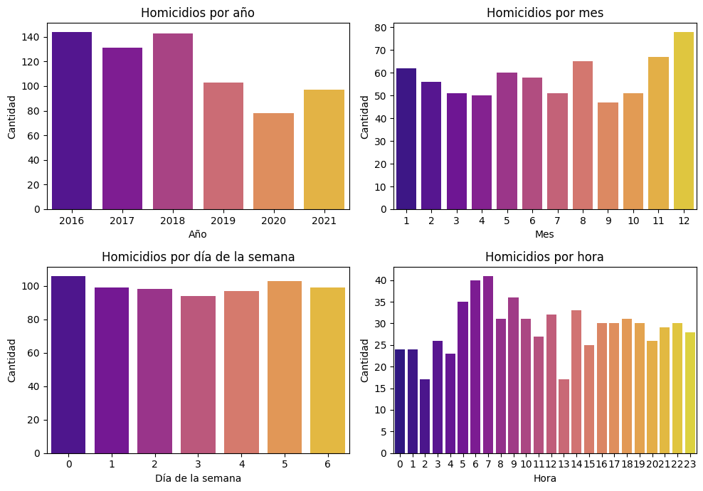
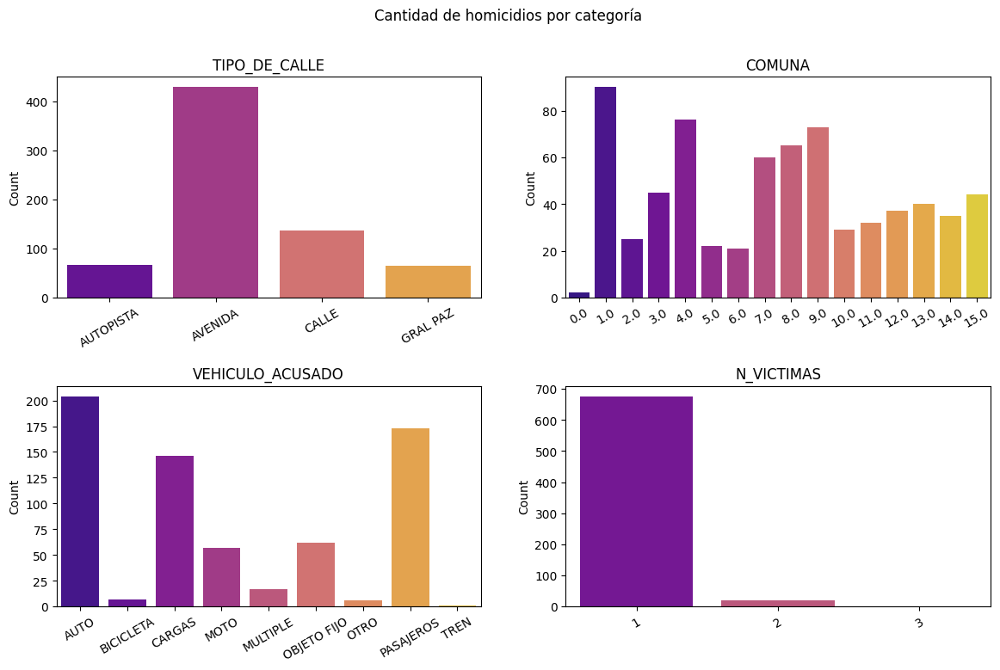
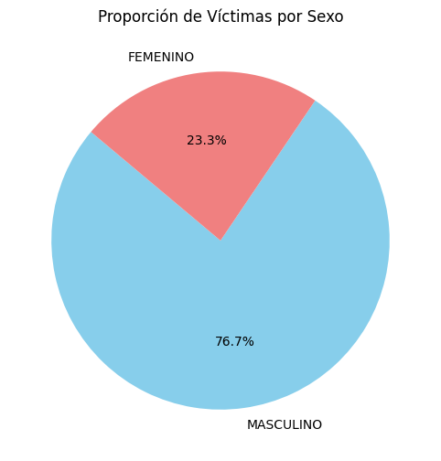

<!-- inserta una imagen de un accidente vial -->

# <h1 align=center> **PROYECTO INDIVIDUAL Nº2** </h1>
# <h1 align=center>**`SINIESTROS VIALES`**</h1>

## Objetivo 
Generar un análisis de los datos, de forma exhaustiva, con el fin de  obtener hallazgos con información clave, que permita generar un mejor entendimiento del problema y brinde la posibilidad de proyectar pautas resolutivas de manera integral y eficiente.

## ETL
En [ETL](https://github.com/KeylaSernaB/PI_DA/blob/main/Notebooks/ETL.ipynb) encontramos el código para la extracción, transformación y carga de los datos de accidentes viales en la Ciudad de Buenos Aires. Los datos se obtuvieron de la página de datos abiertos de la Ciudad de Buenos Aires. }
Se realizó los siguientes pasos:
1. Extracción de los datos de la página de datos abiertos de la Ciudad de Buenos Aires.
2. Transformación de los datos para obtener un dataframe con las columnas de interés.
3. Carga de los datos en un archivo csv.

## EDA
En el [EDA](https://github.com/KeylaSernaB/PI_DA/blob/main/Notebooks/EDA.ipynb) encontramos el código para el análisis exploratorio de los datos de accidentes viales en la Ciudad de Buenos Aires. 
Contiene los siguientes pasos:
1. Lectura de los datos de accidentes viales en la Ciudad de Buenos Aires.
2. Análisis exploratorio de los datos. algunos de los análisis se pueden ver en las siguientes imágenes:

## Análisis de KPIs y Tendencias de Comportamiento en python
En el archivo [KPI](https://github.com/KeylaSernaB/PI_DA/blob/main/Notebooks/kpis.ipynb), se realizó la visualización y el análisis de los Key Performance Indicators (KPIs), donde se utilizó la librería  matplotlib y seaborn en Python para crear los gráficos necesarios que pudieran reflejar los dos KPIs solicitados. Estos gráficos permitieron visualizar las tendencias y los valores de los KPIs, a lo largo del tiempo requerido, de manera comparativa y en el contexto específico en el que se situaba el período, con el fin de comprender su desempeño y su evolución.

→ Reducir en un 10% la tasa de homicidios en siniestros viales de los últimos seis meses, en CABA, en comparación con la tasa de homicidios en siniestros viales del semestre anterior
→ Reducir en un 7% la cantidad de accidentes mortales de motociclistas en el último año, en CABA, respecto al año anterior

* Creación de un Tercer KPI: además de los KPIs solicitados, se creó un tercer indicador de rendimiento (KPI), el cual se diseñó con el propósito de complementar y enriquecer la evaluación de los KPIs otorgados como requerimiento básico, logrando una perspectiva más completa y profunda.
  
→ Reducir en un 5% la cantidad de accidentes mortales de autos en el último añsemestre del año 2021,  respecto al semestre anterior.

## Despliegue en Power Bi | Análisis de KPIs y Tendencias 

El enfoque se centró en el análisis de las tendencias de comportamiento de los KPIs. Esto implicó examinar cómo los KPIs se comportan a lo largo del tiempo como también en función de otras variables como franja horaria, tipo de calles, sexo, edad, entre otras. Esto permitió identificar patrones, fluctuaciones y posibles factores que podrían estar relacionados a las causas del problema. 
Se diagramó una lógica que parte de lo general, reflejada en los gráficos seleccionados, que permite ubicar una información particular en el tiempo, para no perder el contexto de la información. Asimismo la visualización de los KPIs se complementaron con los hallazgos encontrados en las metricas realizadas con Python.

# KPI

Se plantearon 3 objetivos para disminuir las víctimas en siniestros, los 3 Indicadores Claves de Rendimiento (KPI) son los siguientes:

- *Reducir en un 10% la tasa de homicidios en siniestros viales de los últimos seis meses, en CABA, en comparación con la tasa de homicidios en siniestros viales del semestre anterior*.
  
  Definimos a la **tasa de homicidios en siniestros viales** como el número de víctimas fatales en accidentes de tránsito por cada 100,000 habitantes en un área geográfica durante un período de tiempo específico.
  Su fórmula es: (Número de homicidios en siniestros viales / Población total) * 100,000
  
- *Reducir en un 7% la cantidad de accidentes mortales de motociclistas en el último año, en CABA, respecto al año anterior*.
  
  Definimos a la **cantidad de accidentes mortales de motociclistas en siniestros viales** como el número absoluto de accidentes fatales en los que estuvieron involucradas víctimas que viajaban en moto en un determinado periodo temporal.
  Su fórmula para medir la evolución de los accidentes mortales con víctimas en moto es: (Número de accidentes mortales con víctimas en moto en el año anterior - Número de accidentes mortales con víctimas en moto en el año actual) / (Número de accidentes mortales con víctimas en moto en el año anterior) * 100

- *Reducir en un 15% la cantidad de accidentes mortales de peatones en el último año, en CABA, respecto al año anterior*.
  
  Definimos a la **cantidad de accidentes mortales de peatones en siniestros viales** como el número absoluto de accidentes fatales en los que estuvieron involucradas víctimas peatones en un determinado periodo temporal.
  Su fórmula para medir la evolución de los accidentes mortales con víctimas peatones es: (Número de accidentes mortales con víctimas peatones en el año anterior - Número de accidentes mortales con víctimas peatones en el año actual) / (Número de accidentes mortales con víctimas peatones en el año anterior) * 100

## CONCLUSIONES

los Accidentes de la ciudad de Buenos Aires se han reducido mas de lo esperando con la metrica planteada por el gobierno de la ciudad, sin embargo, los accidentes viales mortales en motocicleta no han tenido una reducción significativa, por lo que se debe de poner especial atención en este tipo de accidentes.

Se pueden ver en los datos que los hombres son los que mas accidentes viales tienen, por lo que se debe de poner especial atención en este grupo de la población y sobre todo en el rango de edad entre 20 y 40 años.

## RECOMENDACIONES

Se recomienda que el gobierno de la ciudad de Buenos Aires ponga especial atención en los accidentes viales mortales en motocicleta, ya que estos no han tenido un aumento significativo, por lo que se debe de poner especial atención en este tipo de accidentes.
